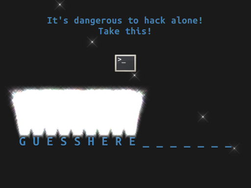

# bkp-cutie-crackme
Boston Key Party CTF 2017 Cutie Crackme Challenge

(Also known as Qt Crackme, and Cutie Keygenme)

This challenge appeared in BKPCTF 2017. It's a reverse engineering challenge written in Qt with a nice GUI.
You have to reverse engineer the algorithm used to verify a key you input.

Solution is in `soln`. Release is in the .zip. Compile with Qt Creator/QMake.

Some writeups:
* https://github.com/ispoleet/ctf-writeups/tree/master/boston_key_party_ctf_2017
* https://gist.github.com/ymgve/1e9d99062f9e526d05382f2b039fdd44
* https://r2s4x.github.io/writeup/2017/03/01/boston-key-party-ctf-2017-qt-crackme-writeup.html (russian)
